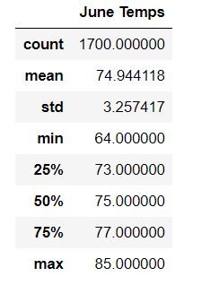
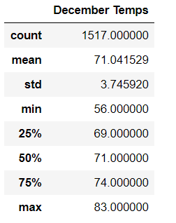
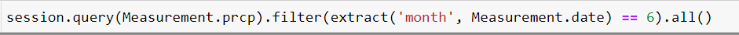
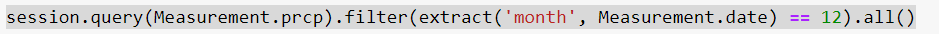

# surfs_up

## Overview of the Analysis 

The purpose of this Analysis was to analyze weather data and more specially the temperature in the island of Oahu in Hawaii to help investor W. Avy understand temperature trends before investing in a surf shop there. The weather data for the months of June and December in Oahu were analyzed to output the common descriptive statistics metrics. The dataset avalable for the analysis was a sqlite database with weather related information recorded from various weather stations in Oahu, Hawaii. Python, Pandas functions and methods and SQLAlchemy was used to retrieve all the temperatures of June and December from our sqlite database and then it was used to generate the summary statistics. This report summarizes the major points from the analysis and provides additional queries that can be performed to gather more weather related data for June and December in Oahu, Hawaii. 

## Results

### Summary Statistics for June 

  
  
  
### Summary Statistics for December

    
  
### Analysis of the Results from the Summary Statistics 

The three major points observed from the summary statistics for June and December weather are as follows: 
- The mean temperature for June is 74.9 F and for December is 71.04 F, which suggests that temperature during summer and winter months are similar and it is warm throughout the year in Oahu. 
- The standard deviation for June is 3.2 and for December it is 3.7. This shows that the data set is telling us that most of the temperature observations are +-3 F from the mean. While the mean is 74.9 F for June and 71.04 F for December, it can be said that there is less variance in these temperature's observed and temperature stays warm consistently throughout the year. 
- The minumum temperature observed for December which is winter is 56 F, whereas the first quartile for December is 69 F, which is relatively warm. Therefore 56F could be an occurence that just happened once and is very uncommon for it to be that cold in Oahu. 

## Summary 

From our summary statistics for the months on temperatures in June and December in Oahu, we can conclude that the temperature stays warm and constant throughout the year. The mean for June and December are in the 70's and it shows that weather is warm during Summer and Winter months which would make it an ideal location for surfing and ice cream all year around. However preipitation should also be looked at when determining if Oahu is the ideal place to open a surf shop as it does have an impact on surfing as well as ice cream sales. Therefore these two queries from our available dataset will help us retrieve and determine the precipation or rainfall for June and December to help us make an informed decision: 

### Query to Retrieve June Precipitation 
  
  
### Query to Retrieve December Precipitation
  
  
After we retrieve the precipitation data for both the months, we can further analyze this data and along with the analysis of our temperature data we can decide if Oahu is indeed the ideal location to open the surf shop. 
